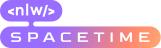
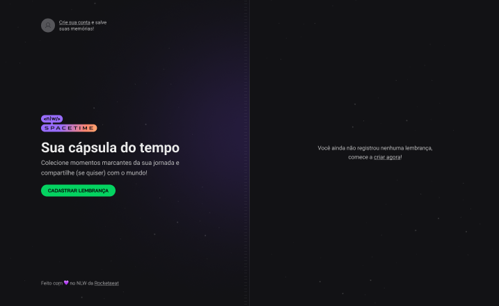
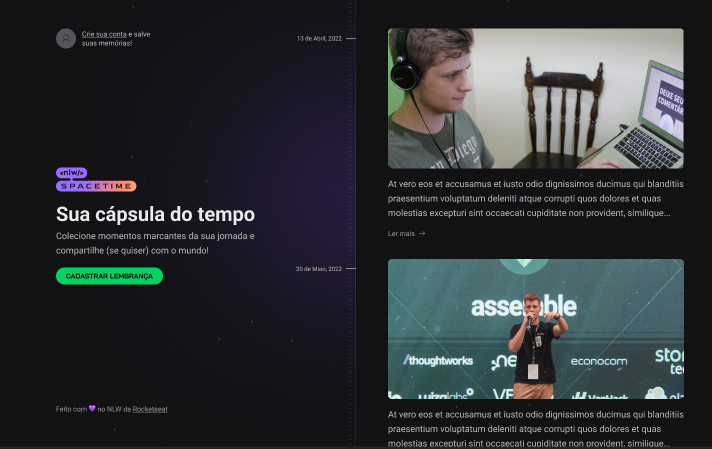
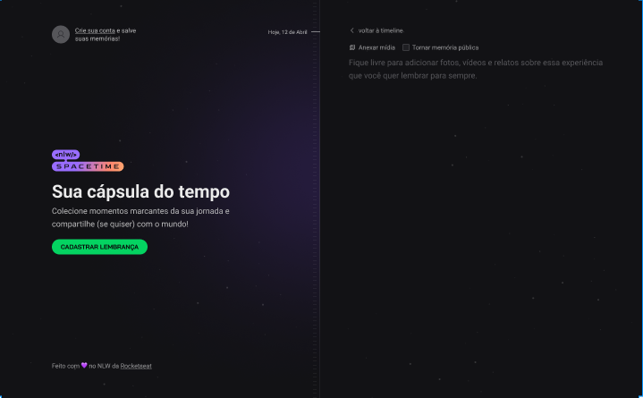
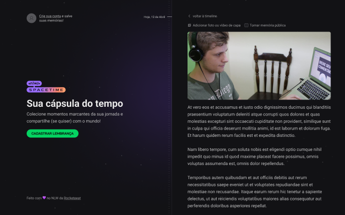

  

 

# NLW - SPACETIME
Aplicação desenvolvida durante a NLW 12 da Rocketseat, com o intuito de salvar uma memoria, uma imgem com uma descrição para voce se lembrar sempre que quiser.

# Tecnologias

Está aplicação foi criada utilizando `NextJS`, `Tailwindcss`, `Typescript`.

# Telas

### Pagina inicial

### Pagina das memorias

### Pagina de cadastro de memorias

### Pagina preenchida com as memorias

 

# Autor

<h1>Glendson Garcete</h1>
<strong>FullStack Developer</strong>
 
 

 
 

